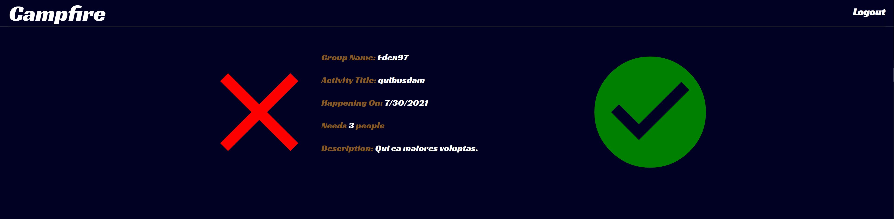
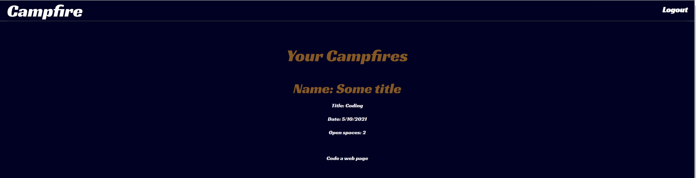
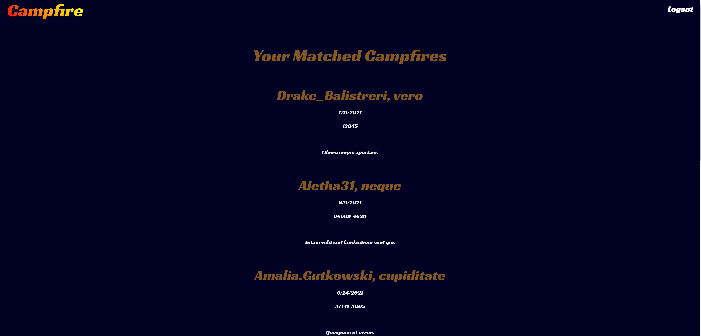

# Campfire
---
    
    
                  
---

    
## Table Of Contents
---
* [Installation](#installation)
* [Usage](#usage)
* [Credits](#credits)
* [Licensing](#licensing)
* [Features](#features)
* [Future Development](#future-development)
* [Contribute To This Project](#contribute)
* [Questions and Contact Info](#questions-and-contact)

    
## Description
---
A full-stack web application to find groups near you looking for additional people to do a given activity.  Users create an account for full access to the site.  From there, they may find a Campfire (main function), create a Campfire, view Campfires they have matched with, and view Campfires they have created.
    

    
## Installation
---
The live app is deployed on [Heroku](https://secret-bastion-06521.herokuapp.com/)

    
## Usage
---
Users must create an account in order to access the functionality of the site.  From there, all options are listed on the Dashboard, which can be accessed at any time by clicking the Campfire logo on the top left of each screen.  If not logged in, users will be prompted to do so before being directed to the Dashboard.

### Screenshots
---
Sample Campfire Match Choice

---

Sample of Campfires This User Has Created

---
Sample of Campfires This User Has Matched With

    
## Credits
---
Thank you to:
[Andii Magyar](https://github.com/andiimagyar)

    
## Licensing
---
Copyright 2021 Shawn Littrel 
    
    Permission is hereby granted, free of charge, to any person obtaining a copy of this software and associated documentation files (the "Software"), to deal in the Software without restriction, including without limitation the rights to use, copy, modify, merge, publish, distribute, sublicense, and/or sell copies of the Software, and to permit persons to whom the Software is furnished to do so, subject to the following conditions:  
        
    The above copyright notice and this permission notice shall be included in all copies or substantial portions of the Software. 
        
    THE SOFTWARE IS PROVIDED "AS IS", WITHOUT WARRANTY OF ANY KIND, EXPRESS OR IMPLIED, INCLUDING BUT NOT LIMITED TO THE WARRANTIES OF MERCHANTABILITY, FITNESS FOR A PARTICULAR PURPOSE AND NONINFRINGEMENT. IN NO EVENT SHALL THE AUTHORS OR COPYRIGHT HOLDERS BE LIABLE FOR ANY CLAIM, DAMAGES OR OTHER LIABILITY, WHETHER IN AN ACTION OF CONTRACT, TORT OR OTHERWISE, ARISING FROM, OUT OF OR IN CONNECTION WITH THE SOFTWARE OR THE USE OR OTHER DEALINGS IN THE SOFTWARE.

    
## Features
---
Create Groups, View Matched Groups, Match With Other Groups

## Future Development
---
Future versions of this app will include a more polished user interface - this is our main priority.  We are also working on location polling instead of relying on user input to determine how to match users with Campfires near them.

    
    
## Contribute
---
Want to contribute to this project?  Please make a pull request at github.com/shawnlittrel/campfire

    
## Questions And Contact
---
* Author: [Shawn Littrel](www.github.com/shawnlittrel)
* GitHub: (github.com/shawnlittrel/campfire)
* Email: shawnlittrel@gmail.com
    
    
